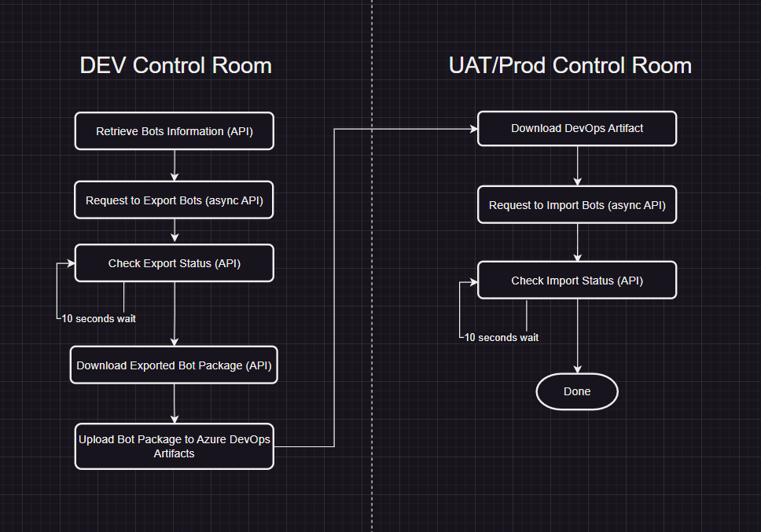
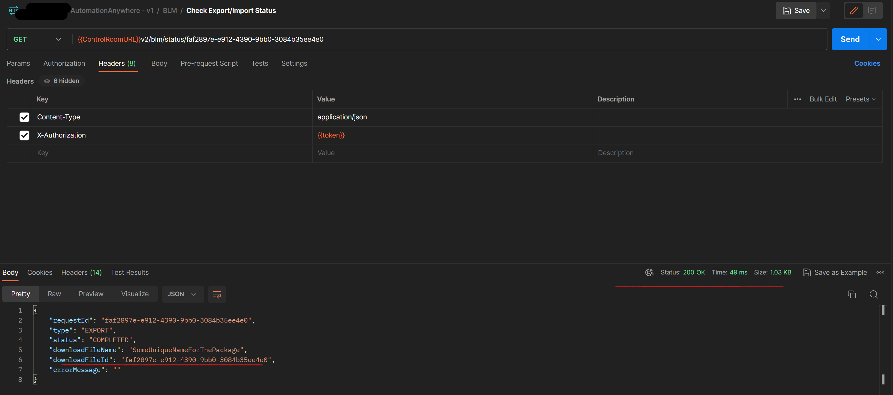
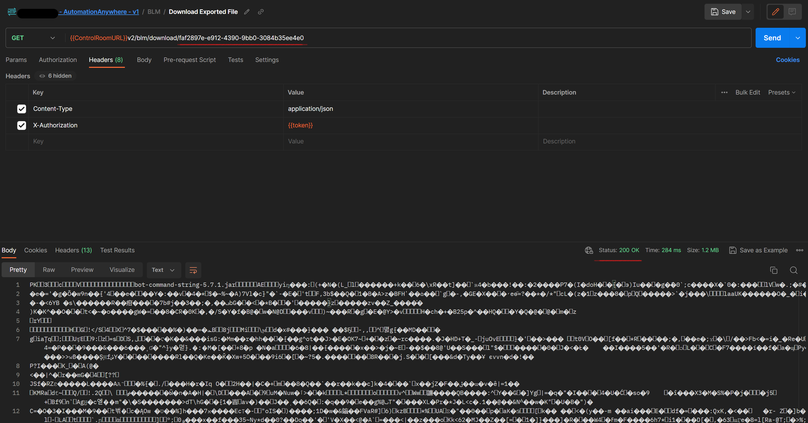
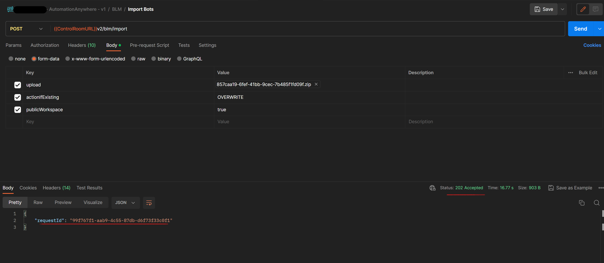

# Automation Anywhere Azure DevOps Pipeline

In this blog, we will explore how to build an Azure DevOps Pipeline for moving bots between Development Control Room and UAT/Production for Automation Anywhere 360, the cloud service offered by Automation Anywhere.

The code and the content of this blog is also available on [Arinco Community GitHub](https://github.com/arinco-crew-community/automation-anywhere-devops)

## What is Automation Anywhere

In simple terms, Automation Anywhere is a Robotic Process Automation (RPA) solution that offers numerous tools to automate repetitive tasks. Although it's a more complex RPA provider, a detailed exploration of its functionalities falls outside the purview of this blog article.

If you like reading documentations, Automation Anywhere itself has a lot to say in [their docs](https://docs.automationanywhere.com/bundle/enterprise-v2019/page/enterprise-cloud/topics/product-feature-lifecycle/learn-overview.html)

If you enjoy watching video courses, I think for the most part the videos from YouTube have you covered, I have links to a number of them in [Additional Resources](#additional-resources) that you might want to check out

## Why we need DevOps Pipeline

Automation Anywhere 360 allows users to design, execute, and manage versions of bots using integrated lifecycle management within a single Control Room. However, in practice, organizations often use multiple Control Rooms to segregate user access and differentiate between development and production versions, the latter being used by actual consumers.

In this particular scenario, the customer utilizes three distinct environments (Control Rooms): Development, User Acceptance Testing (UAT), and Production. Completed bots are initially exported from the Development environment to the UAT Control Room for further testing. Once they meet the customer's requirements in the UAT environment, they are then moved to the Production Control Room for actual use.

Automation Anywhere comes with its own built-in source control system for managing data, files, and other resources within a single Control Room. Additionally, it offers a `Remote Git Repository Integration` feature, allowing users to utilize alternative source control systems, such as Azure DevOps.

`Remote Git Repository Integration` however, does not have any features to package bots from one control room and move them to another.
The user interface of the control gives users the ability to manually export bots and then if they login to another control room they can import the packaged bots. This has caused a lot of confusion for the customer as people at random export and import bots causing the previosly running bots to fail in production.

Automation Anywhere provides REST APIs to enable automation of bot life cycle management. And in the rest of this article, I will explain how to use the provided APIs to export desired bots and import them to the other control rooms.

## DevOps steps

In order to move bots from one Automation Anywhere Control Room to another for example dev to uat, you need to use [Control Room APIs](https://docs.automationanywhere.com/bundle/enterprise-v2019/page/enterprise-cloud/topics/control-room/control-room-api/cloud-control-room-apis.html). This page gives an introduction to control room API and it also include a postman collection which can be used as a playground to understand the API cababilities better

The diagram below shows steps to accomplish deployment of bots from Dev to UAT and then after approval to production

## Deployment Process

1. After bots are properly deployed and tested in the **development control room**, the pipeline is manually initiated using a list of comma-separated bot IDs.

2. First, [the pipeline](https://github.com/arinco-crew-community/automation-anywhere-devops/blob/fd591a4e977f5ec79f00595fe40090da348c3b63/pipeline/azure-pipelines.yml) authenticates to the **development Control Room**. (For more information, see [Authentication](#authentication)).

3. Following authentication, it requests information about the given bot(s). (For more information, see [Get Bots Information](#get-bots-information)).

4. As the next setp, it creates a request to export bot(s). (For more information, see [Export Request](#export-request)).

5. Since the export request is asynchronous, [the pipeline](https://github.com/arinco-crew-community/automation-anywhere-devops/blob/fd591a4e977f5ec79f00595fe40090da348c3b63/pipeline/azure-pipelines.yml) periodically checks export status. (For more information, see [Import/Export Status](#importexport-status)).

6. Once the package is ready in the **development Control Room**, [the pipeline](https://github.com/arinco-crew-community/automation-anywhere-devops/blob/fd591a4e977f5ec79f00595fe40090da348c3b63/pipeline/azure-pipelines.yml) downloads the generated zip file using the Control Room API, and uploads it to Azure DevOps artifacts. (For more information, see [Download Exported Bots](#download-exported-bots)).

7. Next, [the pipeline](https://github.com/arinco-crew-community/automation-anywhere-devops/blob/fd591a4e977f5ec79f00595fe40090da348c3b63/pipeline/azure-pipelines.yml) authenticates to the **destination Control Room** (UAT or Prod) to obtain a new access token.

8. After downloading the artifact, [the pipeline](https://github.com/arinco-crew-community/automation-anywhere-devops/blob/fd591a4e977f5ec79f00595fe40090da348c3b63/pipeline/azure-pipelines.yml) creates an asynchronous Import Bot(s) Request. (For more information, see [Import Request](#import-request)).

9. [The pipeline](https://github.com/arinco-crew-community/automation-anywhere-devops/blob/fd591a4e977f5ec79f00595fe40090da348c3b63/pipeline/azure-pipelines.yml) then needs to periodically check the status of the import request until it is successfully done.

### Authentication

[Authentication](https://docs.automationanywhere.com/bundle/enterprise-v2019/page/auth-api-supported.html#tag/auth/paths/~1authentication/post) can be achieved using either a combination of username and apiKey, or username and password. For the purposes of this sample DevOps pipeline, we are utilizing the username and apiKey method.

To generate an API Key, it's essential that the user account, which is being used for DevOps, has the privilege to generate API Keys. User privileges in Automation Anywhere are governed by Role-Based Access Control (RBAC), meaning that my user account has been assigned a role that permits the generation of API Keys.

It's important to note that the API key has a default validity period of **45 days**. However, this duration can be customized in the Automation Anywhere settings.

So I went ahead and created and API Key under my user settings

These simple steps enable you to login and receive the token required for the other steps over the same Control Room.

The request to Authenticate if successful returns token with some additional information about the logged in user and their permissions

### Get Bots Information

This step serves as a verification measure using [Repostory Management API](https://docs.automationanywhere.com/bundle/enterprise-v2019/page/repository-management-api.html#tag/Repository/paths/~1workspaces~1%7BworkspaceType%7D~1files~1list/post), wherein we gather data pertaining to the provided bot Ids. It not only facilitates the accumulation of valuable information but also confirms their presence within the public workspace. By employing this method, we can ensure the accuracy of our bot tracking and management process, thereby enhancing the efficiency and reliability of our operations.

### Export Request

[The Export Request](https://docs.automationanywhere.com/bundle/enterprise-v2019/page/blm-api.html#tag/BLM/paths/~1v2~1blm~1export/post) is a Bot LifeCycle Management (BLM) API request, which, upon successful initiation, immediately returns a 202 response. To trigger this request, the user must possess the following permissions for the necessary folders: "Export bots", "View package", and "Check in or Check out".

The requestId provided in the response can be utilized in subsequent steps to both retrieve the status and download the resulting output.

### Import/Export Status

[The Import/Export status](https://docs.automationanywhere.com/bundle/enterprise-v2019/page/blm-api.html#tag/BLM/paths/~1v2~1blm~1status~1%7BrequestId%7D/get) is tracked via the same API and simply indicates the status of the operation, whether it's successful, pending, or has failed. The goal is to receive a 200 HTTP status code, with a `Status` value of `COMPLETED` in the JSON body of the response.

### Download Exported Bots

Using the `requestId` obtained from the export request response, the content of the bots can be downloaded via [BLM Download API](https://docs.automationanywhere.com/bundle/enterprise-v2019/page/blm-api.html#tag/BLM/paths/~1v2~1blm~1download~1%7BdownloadFileId%7D/get) in a zip file format. If an archivePassword was provided during the export request, the downloaded zip file will be password-protected.

### Import Request

As previously discussed, once the bot contents have been downloaded, the subsequent steps involve authenticating with the new control room API and sending a request to import the downloaded zip file using [BLM Import API](https://docs.automationanywhere.com/bundle/enterprise-v2019/page/blm-api.html#tag/BLM/paths/~1v2~1blm~1import/post).

One key distinction with this API compared to others is that the request body uses `form-data`. This presents its own set of unique challenges when making DevOps calls.

## Sample Pipeline

[The sample pipeline](https://github.com/arinco-crew-community/automation-anywhere-devops/blob/fd591a4e977f5ec79f00595fe40090da348c3b63/pipeline/azure-pipelines.yml) is designed for `Azure DevOps`, utilizing the `windows-latest` and `PowerShell` for API calls.

[This pipeline](https://github.com/arinco-crew-community/automation-anywhere-devops/blob/fd591a4e977f5ec79f00595fe40090da348c3b63/pipeline/azure-pipelines.yml) is multi-staged; its function is to zip the specified botIds from the Development stage, then import them into the User Acceptance Testing (UAT) and Production (Prod) environments.

For successful operation, three environment libraries are required with the following values:

- AutomationAnywhere.Url
- AutomationAnywhere.Username
- AutomationAnywhere.ApiKey

Furthermore, [the pipeline](https://github.com/arinco-crew-community/automation-anywhere-devops/blob/fd591a4e977f5ec79f00595fe40090da348c3b63/pipeline/azure-pipelines.yml) requires two environments for managing the approval process. This provision grants administrators the capability to validate the zipped file prior to its import into the UAT and Prod environments.

## Further steps

[The sample pipeline](https://github.com/arinco-crew-community/automation-anywhere-devops/blob/fd591a4e977f5ec79f00595fe40090da348c3b63/pipeline/azure-pipelines.yml) relies on receiving a comma-separated list of BotIds to function. However, it's important to note that this is a simplistic and initial pipeline.

To enhance its functionality, one approach might be to provide users with a web application that offers the following features:

- Display all existing bots in the form of a folder structure, mirroring their presentation in the Control Room, so users can easily select them.

- Provide additional information about the bots, such as their check-out status, the developer responsible for them, and so on.

- Utilise the [Export repository bots by label or version](https://docs.automationanywhere.com/bundle/enterprise-v2019/page/blm-api.html#tag/BLM/paths/~1v2~1blm~1export~1version/post) to have more granular control over what is exported.

These enhancements would make `bot life cycle management` more robust and user-friendly.

To achieve these enhancements, you can utilize the [Repository Management APIs](https://docs.automationanywhere.com/bundle/enterprise-v2019/page/repository-management-api.html). These APIs can be used to fetch information on files, folders, or workspace details, which can be instrumental in listing all existing bots in a structured format and offering more detailed bot information.

## Additional Resources

### Useful articles

- [Bot Lifecycle Management: Bring Calm to Your Bot Development Chaos](https://www.automationanywhere.com/company/blog/product-insights/bot-lifecycle-management-bring-calm-to-your-bot-development-chaos)
- [Create API key generation role](https://docs.automationanywhere.com/bundle/enterprise-v2019/page/enterprise-cloud/topics/control-room/administration/roles/cloud-control-room-apikey-role.html)
- [https://docs.automationanywhere.com/bundle/enterprise-v2019/page/enterprise-cloud/topics/control-room/control-room-api/cloud-control-room-apis.html](https://docs.automationanywhere.com/bundle/enterprise-v2019/page/enterprise-cloud/topics/control-room/control-room-api/cloud-control-room-apis.html)
- [https://docs.automationanywhere.com/bundle/enterprise-v2019/page/enterprise-cloud/topics/bot-insight/user/cloud-bot-lifecycle-management.html](https://docs.automationanywhere.com/bundle/enterprise-v2019/page/enterprise-cloud/topics/bot-insight/user/cloud-bot-lifecycle-management.html)
- [Bot Lifecycle Management in Automation 360](https://community.automationanywhere.com/developers-blog-85009/bot-lifecycle-management-in-automation-360-85112)
- [Integrating Control Room with Git repositories](https://docs.automationanywhere.com/bundle/enterprise-v2019/page/enterprise-cloud/topics/control-room/git-integration/cloud-cr-git-integration.html)

### YouTube Videos

- [Build Your First Automation 360 Bot with Micah Smith](https://www.youtube.com/watch?v=nMUIZx6eAJA&t=465s)
- [Using Version Control in Automation 360 v.22](https://www.youtube.com/watch?v=_646qiId3no)
- [Introduction to the Control Room API](https://www.youtube.com/watch?v=zv34BRfW96Y&t=10s)
- [How to Export a Bot Using the Automation 360 Control Room API](https://www.youtube.com/watch?v=xcAHUvGCgE0)
