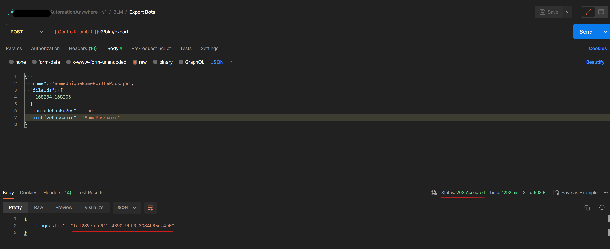

# Automation Anywhere DevOps
In this blog, we will explore how to build an Azure DevOps Pipeline for moving bots between Development Control Room and UAT/Production for Automation Anywhere 360, the cloud service offered by Automation Anywhere.

## What is Automation Anywhere
In simple terms, Automation Anywhere is a Robotic Process Automation (RPA) solution that offers numerous tools to automate repetitive tasks. Although it's a more complex RPA provider, a detailed exploration of its functionalities falls outside the purview of this blog article.

If you like reading documentations, Automation Anywhere itself has a lot to say in [their docs](https://docs.automationanywhere.com/bundle/enterprise-v2019/page/enterprise-cloud/topics/product-feature-lifecycle/learn-overview.html)

If you enjoy watching video courses, I think for the most part the videos from Youtube have you covered, I have links to a number of them in [Additional Resources](#additional-resources) that you might want to check out

## Why we need DevOps Pipeline

Automation Anywhere 360 allows users to design, execute, and manage versions of bots using integrated lifecycle management within a single Control Room. However, in practice, organizations often use multiple Control Rooms to segregate user access and differentiate between development and production versions, the latter being used by actual consumers.

In this particular scenario, the customer utilizes three distinct environments (Control Rooms): Development, User Acceptance Testing (UAT), and Production. Completed bots are initially exported from the Development environment to the UAT Control Room for further testing. Once they meet the customer's requirements in the UAT environment, they are then moved to the Production Control Room for actual use.

Automation Anywhere comes with its own built-in source control system for managing data, files, and other resources within a single Control Room. Additionally, it offers a `Remote Git Repository Integration` feature, allowing users to utilize alternative source control systems, such as Azure DevOps.

`Remote Git Repository Integration` however, does not have any features to package bots from one control room and move them to another.
The user interface of the control gives users the ability to manually export bots and then if they login to another control room they can import the packaged bots. This has caused a lot of confusion for the customer as people at random export and import bots causing the previosly running bots to fail in production.

Automation Anywhere provides REST APIs to enable automation of bot life cycle management. And in the rest of this article, I will explain how to use the provided APIs to export desired bots and import them to the other control rooms.

## DevOps steps
In order to move bots from one Automation Anywhere Control Room to another for example dev to uat, you need to use [Control Room APIs](https://docs.automationanywhere.com/bundle/enterprise-v2019/page/enterprise-cloud/topics/control-room/control-room-api/cloud-control-room-apis.html). This page gives an introduction to control room API and it also include a postman collection which can be used as a playground to understand the API cababilities better

The diagram below shows steps to accomplish deployment of bots from Dev to UAT and then after approval to production

1. Authenticate to source Control Room (using [Authentication API](https://docs.automationanywhere.com/bundle/enterprise-v2019/page/auth-api-supported.html))
2. Create a request to Export Bot(s) with their Id as a zipped package potentially with as a password protected package (using BLM EXPORT API)
3. Prediodically check the status of the export request until it returns `COMPLETED` (using BLM Check Import/Export Status API)
4. Download the generated zip file (using BLM Downloand API)
5. Authenticate to destination Control Room (using Authentication API)
6. Create an Import Bot(s) Request (using BLM Import API)
7. Prediodically check the status of the import request until it returns `COMPLETED` (using BLM Check Import/Export Status API)
8. Once the Status API returns `COMPLETED`, it means that the DevOps operation has been successful

### Authentication
Authentication can be done either with combination of `username` and `apiKey` or `username` and `password`.
For the purpose of this Sample DevOps pipeline we are using `username` and `apiKey`.
In order to create an API Key, I asked that my user(used for DevOps) has access to Generate API Keys.
Users in Automation Anywhere are granted access to different features using RBAC which is role-based-access-control. So my user is granted a role which can generate API Keys
Also the API key is only valid by 45 days but this settings can be changed in Automation Anywhere settings.

So I went ahead and created and API Key under my user settings

These simple steps enable you to login and receive the token required for the other steps over the same Control Room.

The request to Authenticate if successful returns token with some additional information about the logged in user and their permissions

### Export Request
Export Request is a BML API Request which results in a 202 immediate response if successful.
In order to initiate this request the user must have Export bots, View package, and Check in or Check out permissions to the required folders

The `requestId` in the response can be used for further steps to get status and download the results

### Export Status
Import/Export status are the same API and just indicate whether the operation has been successful or pending or failed altogether. What we are looking for is a 200 HttpStatus code with a `Status` of `COMPLETED` in the JSON body of the response

### Download Exported Bots
Using the `requestId` provided in the export request response, the content of the bots can be downloaded as a zip file (password-protected if it was given an `achivePassword` in the export request)

### Import Request
As mentioned before now that the bots contents are downloaded, the next steps are authentication to the new control room API and sending a request to import downloaded zip file

There is one major difference between this API and the rest of the API calls. The request body is `form-data` which has its own challenges in DevOps calls

## Sample Pipeline
The sample pipeline is written for Azure DevOps using `windows-latest` and Powershell for doing the API calls.

This is a multi-staged pipeline to zip the given botIds from the Dev Stage and import them into UAT and then Prod environments.

In order for it to work 3 environment libraries are needed with these values:
- AutomationAnywhere.Url
- AutomationAnywhere.Username
- AutomationAnywhere.ApiKey

The pipeline also needs 2 environments for managing approval process so it gives the administartors the ability to validate the zipped file before importing them into UAT and Prod environments.

## Further steps
The sample Pipeline depends on providing a comma-seperated list of BotIds for it to work. However this is a very initial and simple pipeline.
One possible way to bring about more functionality is provide the users the ability to provide a web application with the following functionalities
- List all existing Bots in the form of folder structure as they are shown in Control Room so user can select them.
- Giving more information about the bots as for example whether they are checked out, who developed them etc.

For the purpose of this extra work, [Repository Management APIs](https://docs.automationanywhere.com/bundle/enterprise-v2019/page/repository-management-api.html) can be used to list files, folders or workspace information

## Additional Resources

### Useful articles
- [Bot Lifecycle Management: Bring Calm to Your Bot Development Chaos](https://www.automationanywhere.com/company/blog/product-insights/bot-lifecycle-management-bring-calm-to-your-bot-development-chaos)
- [Create API key generation role](https://docs.automationanywhere.com/bundle/enterprise-v2019/page/enterprise-cloud/topics/control-room/administration/roles/cloud-control-room-apikey-role.html)
- [https://docs.automationanywhere.com/bundle/enterprise-v2019/page/enterprise-cloud/topics/control-room/control-room-api/cloud-control-room-apis.html](https://docs.automationanywhere.com/bundle/enterprise-v2019/page/enterprise-cloud/topics/control-room/control-room-api/cloud-control-room-apis.html)
- [https://docs.automationanywhere.com/bundle/enterprise-v2019/page/enterprise-cloud/topics/bot-insight/user/cloud-bot-lifecycle-management.html](https://docs.automationanywhere.com/bundle/enterprise-v2019/page/enterprise-cloud/topics/bot-insight/user/cloud-bot-lifecycle-management.html)
- [Bot Lifecycle Management in Automation 360](https://community.automationanywhere.com/developers-blog-85009/bot-lifecycle-management-in-automation-360-85112)
- [Integrating Control Room with Git repositories](https://docs.automationanywhere.com/bundle/enterprise-v2019/page/enterprise-cloud/topics/control-room/git-integration/cloud-cr-git-integration.html)

### Youtube Videos
- [Build Your First Automation 360 Bot with Micah Smith](https://www.youtube.com/watch?v=nMUIZx6eAJA&t=465s)
- [Using Version Control in Automation 360 v.22](https://www.youtube.com/watch?v=_646qiId3no)
- [Introduction to the Control Room API](https://www.youtube.com/watch?v=zv34BRfW96Y&t=10s)
- [How to Export a Bot Using the Automation 360 Control Room API](https://www.youtube.com/watch?v=xcAHUvGCgE0)